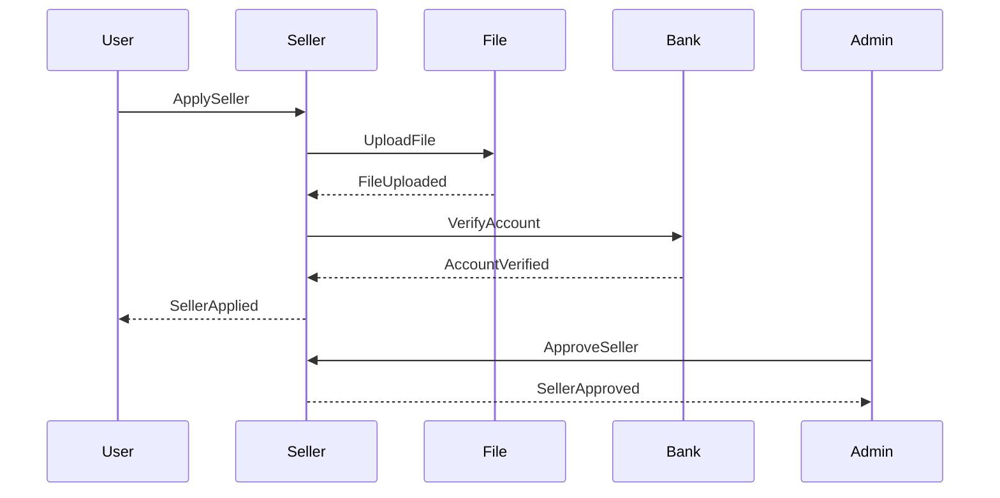
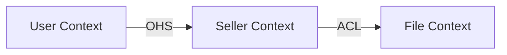

# Event Storming 가이드

참조: `.claude/rules/architecture.md`

## 단계

### 1. Domain Events (과거형)
비즈니스에서 일어나는 중요한 사건

**예시**: 셀러 시스템
- 셀러 신청됨 (SellerApplied)
- 파일 업로드됨 (FileUploaded)
- 계좌 확인됨 (AccountVerified)
- 셀러 승인됨 (SellerApproved)
- 셀러 거절됨 (SellerRejected)

### 2. Commands (명령형)
이벤트를 발생시키는 행위

**예시**:
- 셀러 신청 (ApplySeller)
- 파일 업로드 (UploadFile)
- 계좌 확인 (VerifyAccount)
- 셀러 승인 (ApproveSeller)
- 셀러 거절 (RejectSeller)

### 3. Aggregates (명사)
Command를 처리하고 Event를 발생시키는 도메인 객체

**예시**:
- Seller (셀러)
- Document (서류)

**Seller Aggregate**:
```
상태: PENDING, APPROVED, REJECTED
행위: apply(), approve(), reject()
불변식: 1인 1셀러, 암호화 필수
```

### 4. Bounded Context
관련 Aggregate를 묶은 경계

**예시**: 셀러 시스템
- **Seller Context** (Core)
    - Seller
    - Document
- **File Context** (Supporting)
    - File Upload
- **User Context** (Generic)
    - User (외부)

### 5. Context Map
컨텍스트 간 관계

```
User Context → Seller Context (OHS: Open Host Service)
Seller Context → File Context (ACL: Anti-Corruption Layer)
```

## 템플릿

### Domain Events 정리
```markdown
| Event | Trigger | Data |
|-------|---------|------|
| SellerApplied | 사용자 신청 | userId, sellerName, ... |
| SellerApproved | 관리자 승인 | sellerId, approvedAt |
```

### Commands 정리
```markdown
| Command | Actor | Aggregate | Event |
|---------|-------|-----------|-------|
| ApplySeller | User | Seller | SellerApplied |
| ApproveSeller | Admin | Seller | SellerApproved |
```

### Aggregates 정의
```markdown
## Seller Aggregate

**Root**: Seller
**Entities**: -
**Value Objects**: BusinessNo, AccountNo

**상태**:
- PENDING
- APPROVED
- REJECTED

**불변식**:
- 사업자번호 10자리
- 계좌번호 암호화 필수
- 1인 1셀러

**행위**:
- apply(): 신청
- approve(): 승인
- reject(): 거절
```

## Mermaid 다이어그램

### Event Flow


### Context Map


참고: `templates/` 폴더