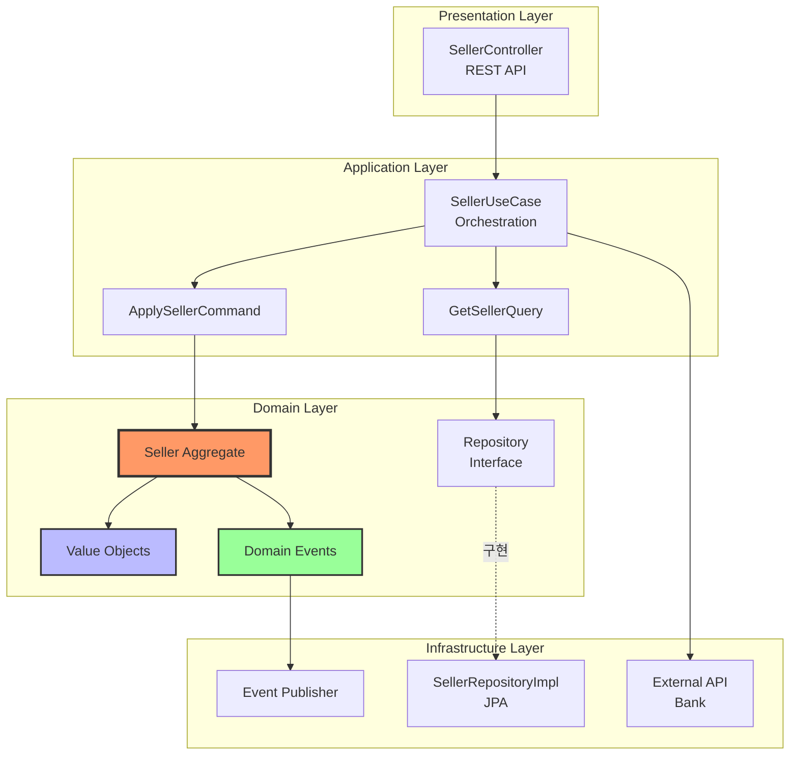

# Architecture Layers Template

## 레이어별 역할

### Presentation
- REST API
- Request/Response DTO
- Validation

### Application
- Use Case 조율
- 트랜잭션 경계
- Command/Query 분리

### Domain
- 비즈니스 로직
- Aggregate
- Domain Event
- Repository Interface

### Infrastructure
- DB 연동
- 외부 API
- Event Publishing