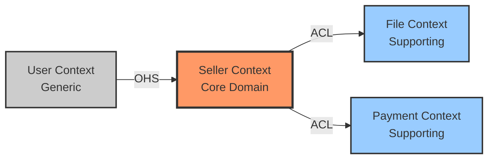

# Context Map Template

## 관계 타입
- **OHS** (Open Host Service): 공개 API
- **ACL** (Anti-Corruption Layer): 방어 계층
- **CF** (Conformist): 순응
- **PS** (Published Language): 공통 언어

## 컨텍스트 타입
- **Core**: 핵심 (빨강)
- **Supporting**: 지원 (파랑)
- **Generic**: 범용 (회색)