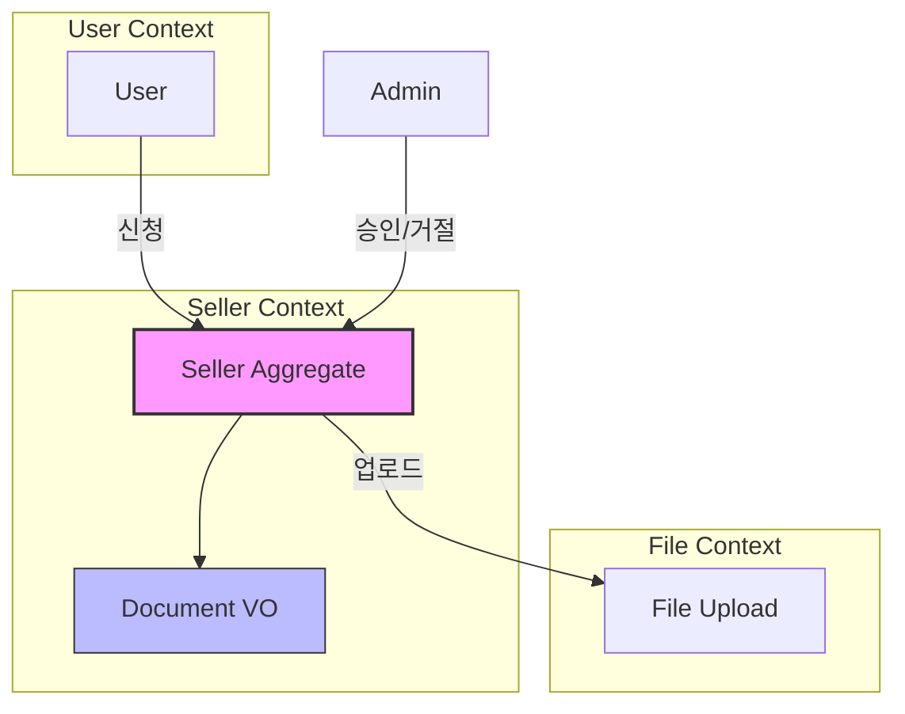

# Domain Overview Template

```mermaid
graph TB
    subgraph "Seller Context"
        Seller[Seller Aggregate]
        Document[Document VO]
        Seller --> Document
    end
    
    subgraph "File Context"
        File[File Upload]
    end
    
    subgraph "User Context"
        User[User]
    end
    
    User -->|신청| Seller
    Seller -->|업로드| File
    Admin[Admin] -->|승인/거절| Seller
    
    style Seller fill:#f9f,stroke:#333,stroke-width:2px
    style Document fill:#bbf,stroke:#333,stroke-width:1px
```

## 사용법
- Aggregate: 핑크
- Value Object: 블루
- 외부 Actor: 회색