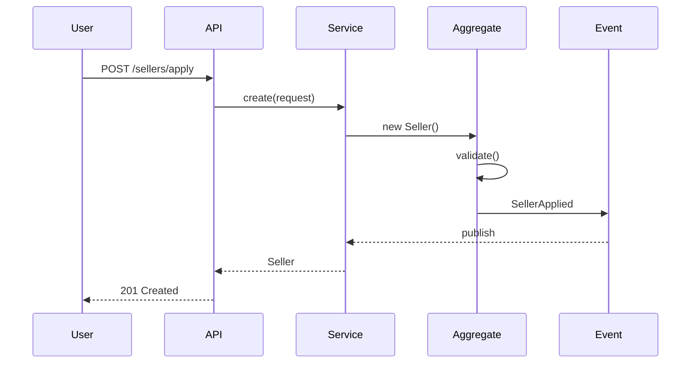

# Event Flow Template

```mermaid
sequenceDiagram
    participant User
    participant API
    participant Service
    participant Aggregate
    participant Event
    
    User->>API: POST /sellers/apply
    API->>Service: create(request)
    Service->>Aggregate: new Seller()
    Aggregate->>Aggregate: validate()
    Aggregate->>Event: SellerApplied
    Event-->>Service: publish
    Service-->>API: Seller
    API-->>User: 201 Created
```

## 사용법
- 시간 순서대로
- 동기: 실선 (->)
- 비동기: 점선 (-->)
- Event는 별도 participant